<p align="center">
    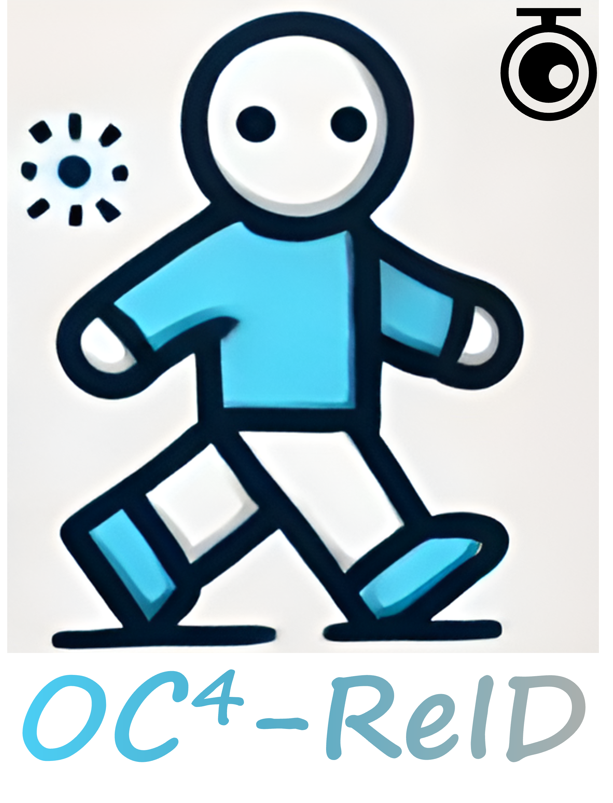
</p>


## OC<sup>4</sup>-ReID: Occluded Cloth-Changing Person Re-Identification


### [[Paper](TBD)] 

[Zhihao Chen](https://scholar.google.com/citations?user=SBoHvVQAAAAJ&hl=zh-CN), [Yiyuan Ge](https://scholar.google.com/citations?user=qKxpHGcAAAAJ&hl=zh-CN), [Ziyang Wang](https://scholar.google.com/citations?hl=en&user=GWF20_wAAAAJ), Jiaju Kang, Mingya Zhang

<p align="center">
    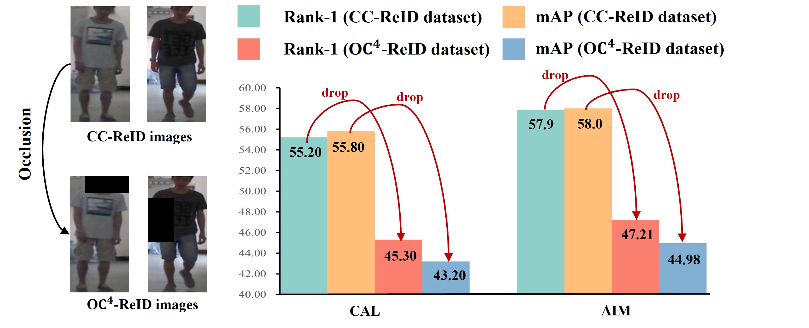
</p>


<p align="center">
    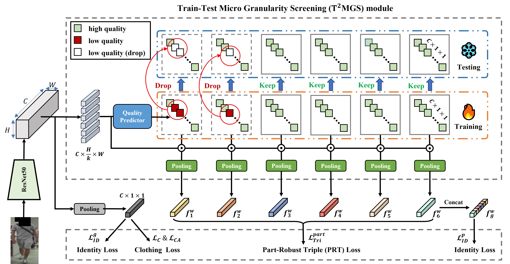
</p>


⭐If this work is helpful for you, please help star this repo. Thanks!🤗


<a name="Getting_Started">
</a>

## Getting Started

### Installation

**Step 1: Clone the this repository**

To get started, first clone the OC4-ReID repository and navigate to the project directory:

```bash
git clone https://github.com/1024AILab/OC4-ReID.git
cd OC4-ReID
```

**Step 2: Environment Setup**

OC4-ReID recommends setting up a conda environment and installing dependencies via pip. Use the following commands to set up your environment:

***Create and activate a new conda environment***

```bash
conda create -n OC4-ReID
conda activate OC4-ReID
```

***Install Dependencies***

```bash
pip install -r requirements.txt
```

**Step 3: Get Started**
Replace _C.DATA.ROOT and _C.OUTPUT in configs/default_img.py with your own data path and output path, respectively. Run:
```script.sh```


## Samples
### Occ-PRCC
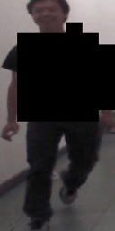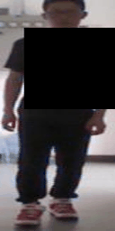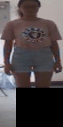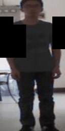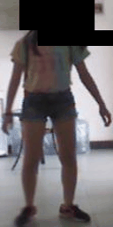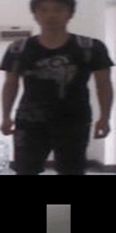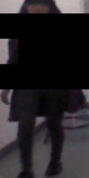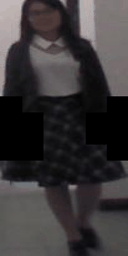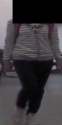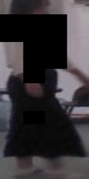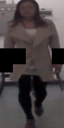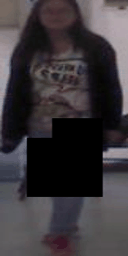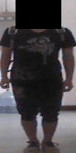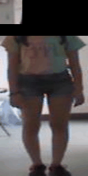


### Occ-LTCC
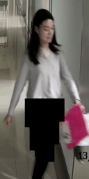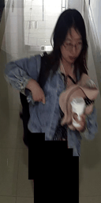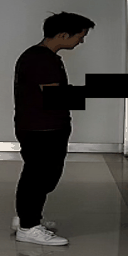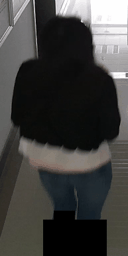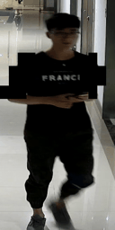


## You can download the datasets at: 
## https://pan.baidu.com/s/1PH4BzbChuHsXuepA7ke-XA  password：sp4s

## https://pan.baidu.com/s/1Zaf9IMZqHG2w2vk13n4rMQ password：v29n
